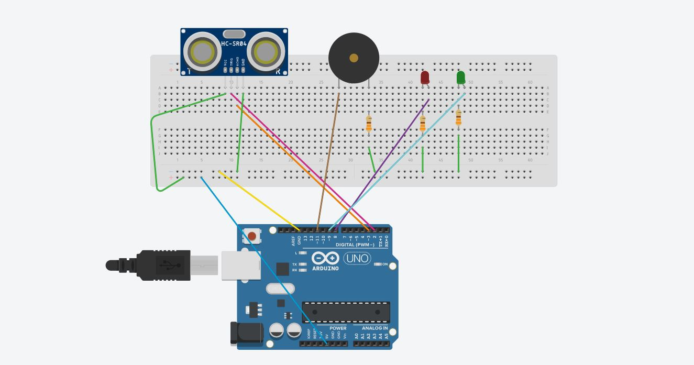
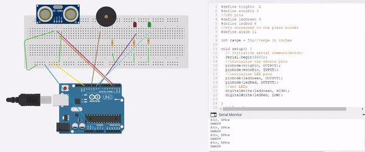

# Ultrasonic-Sensor
Created an Ultrasonic Security Sensor Alarm using an Ultrasonic Sensor, Piezo Buzzer, LED and Arduino UNO
Ultrasonic Sensor transmitts and receives ultrasound and calcultes the distance of the object closest to the sensor, 
if the distance of the unknown object is less than the range entered in our code the alarm senses danger and goes off and the buzzer starts buzzing and the Red LED lights up.
In this case the range entered is 50 inches

# The circuit diagram of our Security Device- 

# The simulation of the ultrasonic sensor security alarm in action-

